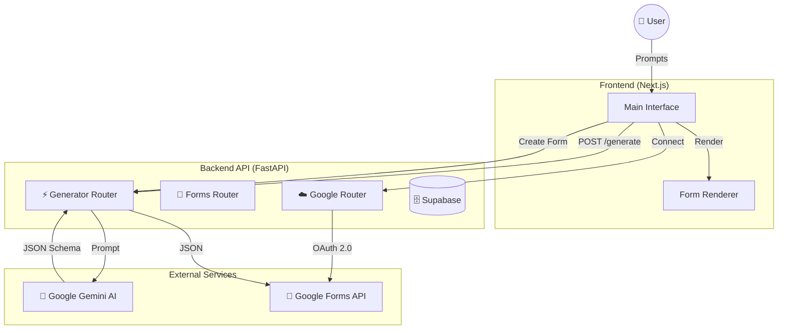

# 📐 ARCHITECTURE DESIGN

## SYSTEM OVERVIEW

**FormSync AI** is a modern web platform that converts natural language descriptions into functional forms. It bridges the gap between **Generative AI** (Google Gemini) and **Practical Tools** (React Forms & Google Forms).



---

## 📁 FOLDER STRUCTURE

The project is a monorepo containing both the Frontend and Backend applications.

```
FormSync-AI/
├── 🌐 apps/web/             # Next.js Frontend
│   ├── 📂 src/app/          # App Router Pages
│   ├── 📂 src/components/   # React Components (FormRenderer)
│   ├── 📄 package.json      # Frontend Dependencies
│   └── 🎨 tailwind.config.ts # Styling Config
│
├── 🐍 apps/api/             # FastAPI Backend
│   ├── 📂 core/             # Config & Auth Logic
│   ├── 📂 routers/          # API Endpoints (Generator, Google)
│   ├── 📂 services/         # Business Logic (LLM, Google Forms)
│   ├── 🐍 main.py           # Entry Point
│   └── 📄 requirements.txt  # Python Dependencies
│
└── 📄 docker-compose.yml    # Orchestration (Optional)
```

---

## 🛠️ TECH STACK

| Layer | Technology | Purpose |
| :--- | :--- | :--- |
| **Frontend** | Next.js 15 (React 19) | Reactive UI, Server Components |
| **Styling** | TailwindCSS + Lucide | Modern, utility-first design |
| **Backend** | FastAPI (Python 3.11) | High-performance async API |
| **AI Engine** | Google Gemini 1.5 Flash | Fast, low-latency text-to-JSON generation |
| **Integration** | Google Forms API | Programmatic form creation via OAuth 2.0 |
| **Database** | Supabase (PostgreSQL) | Persisting generated forms (Optional) |

---

## 🔐 DATA FLOW

### 1. Form Generation (AI)
1. User enters prompt (e.g., "Feedback form for workshop").
2. Frontend sends prompt to `POST /generate`.
3. Backend constructs a prompt for **Gemini 1.5 Flash**.
4. Gemini returns a raw JSON object conforming to our `FormSchema`.
5. Backend validates and cleans the JSON.
6. Frontend receives JSON and renders it using `FormRenderer` component.

### 2. Google Forms Integration
1. User clicks **"Connect Google"**.
2. App redirects to Google OAuth consent screen.
3. User approves; Google redirects back to `/auth/callback`.
4. Backend swaps code for **Access Token** & stores it.
5. User clicks **"Generate & Create Google Form"**.
6. Backend generates schema via Gemini (as above).
7. Backend translates schema to **Google Forms Batch Requests**.
8. Backend calls Google Forms API to create form + items.
9. App displays the live Edit/Response URL.
